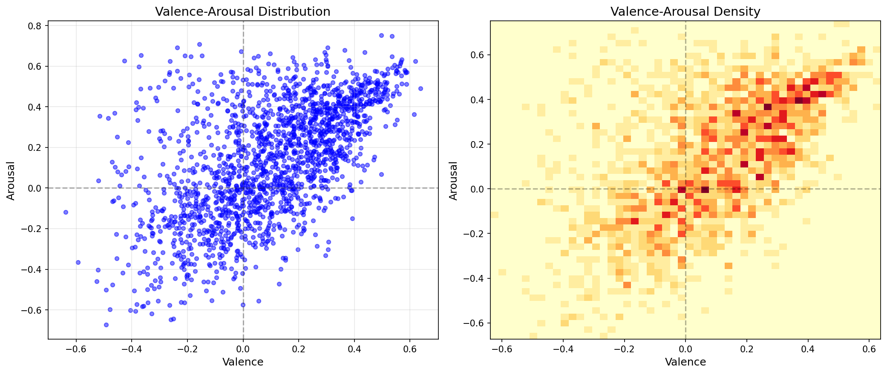
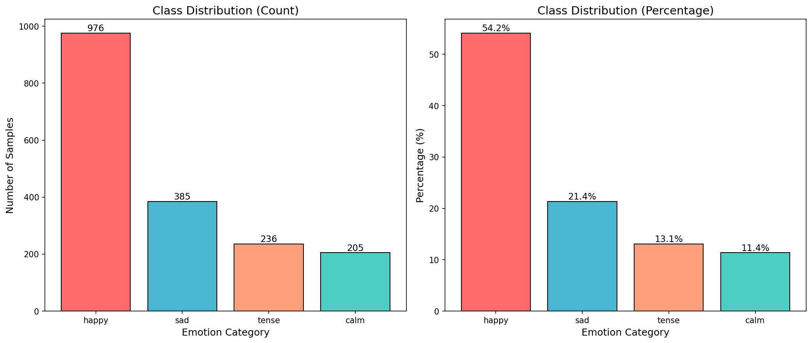
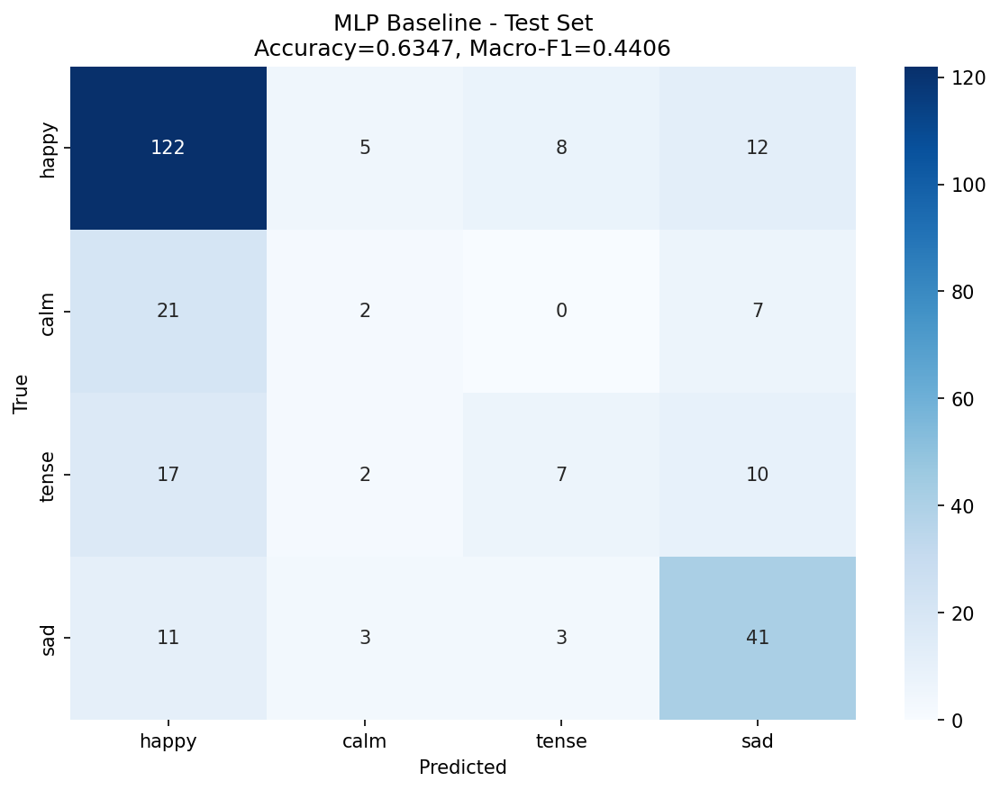
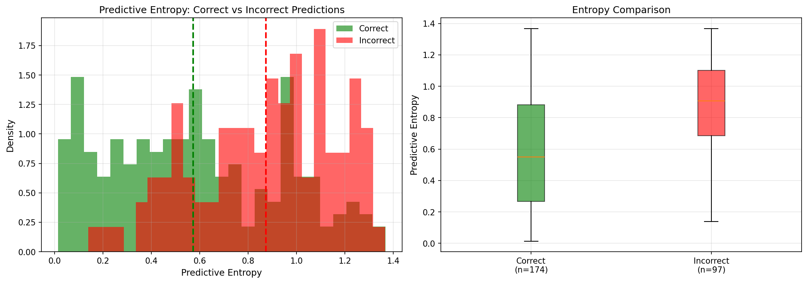
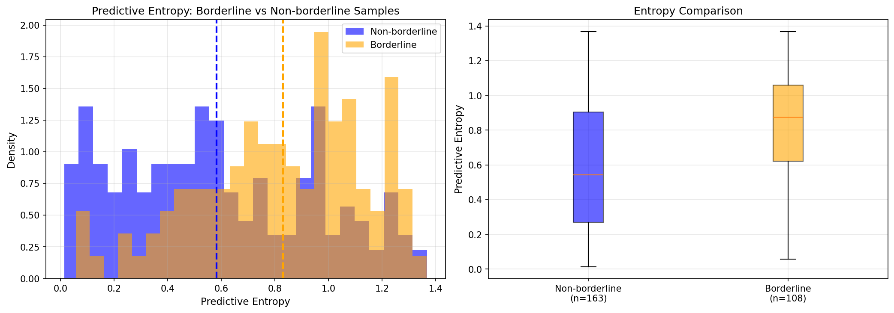
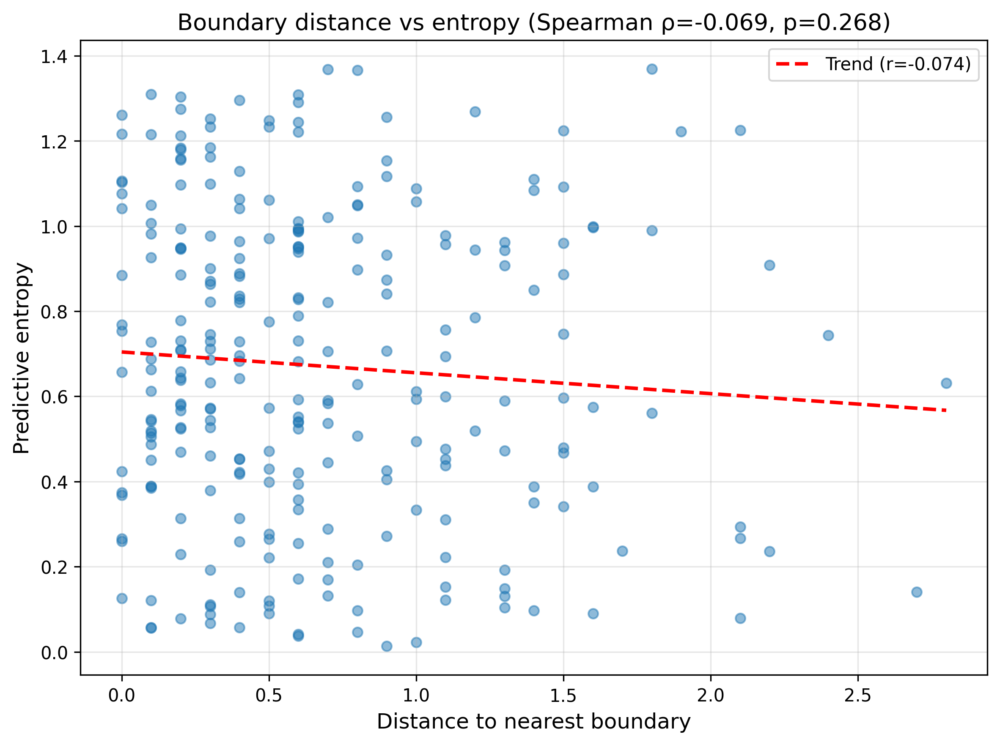
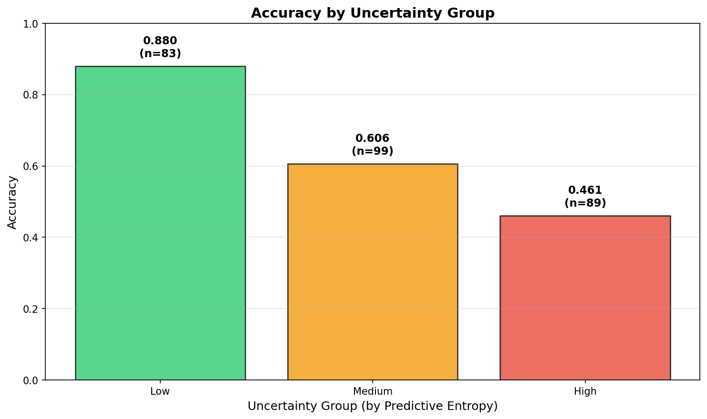
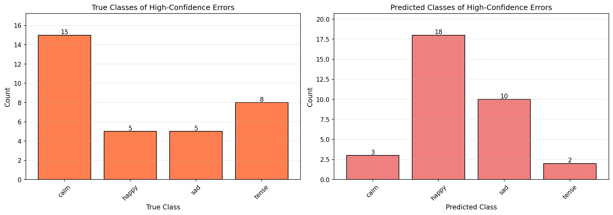
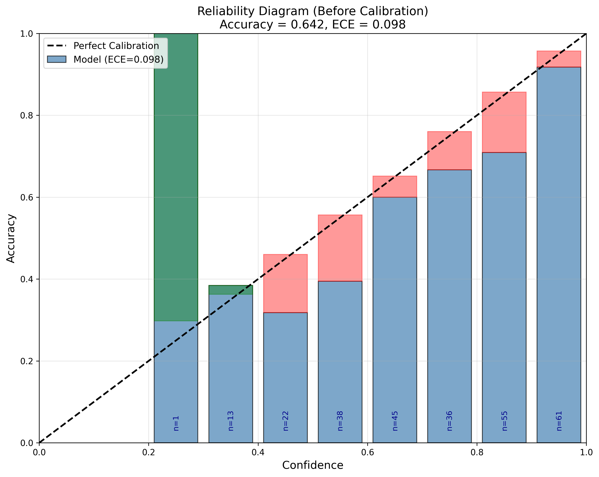
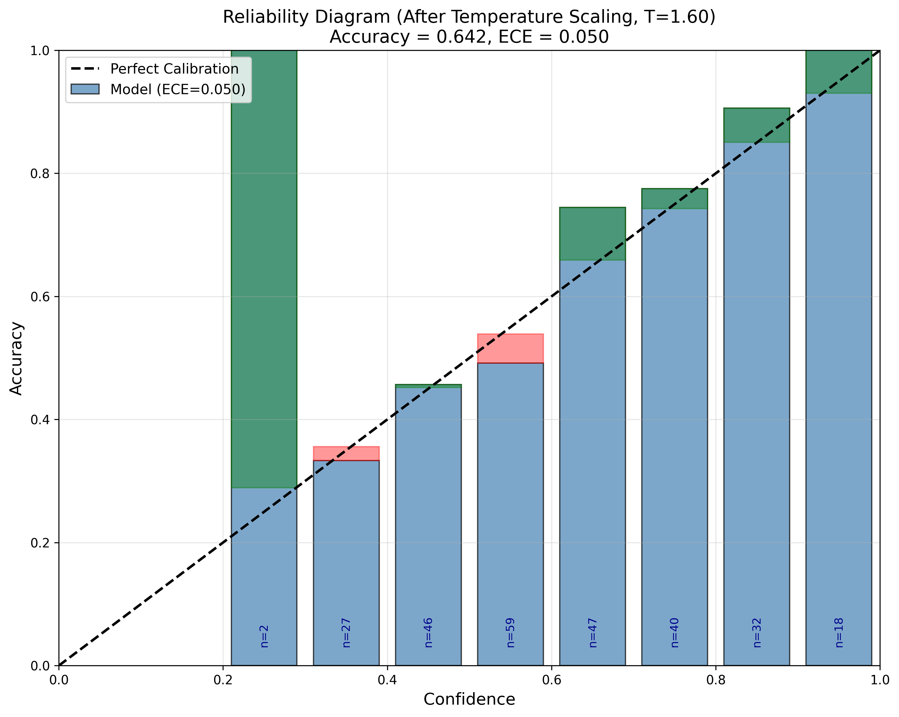

# Quantifying Predictive Uncertainty and Improving Calibration in Music Emotion Classification

## Abstract

Most music emotion classifiers are judged by accuracy alone. But when a model says it's 90% confident, should we believe it? This project looks at two things: whether MC Dropout can spot uncertain predictions, and whether simple calibration fixes help.

I found that wrong predictions had much higher entropy (0.87 vs 0.57, p < 0.001), and songs near emotion boundaries were also more uncertain. But 34% of errors were still made with high confidence, so uncertainty alone isn't enough. The model was overconfident (ECE = 9.8%), and temperature scaling with T=1.60 fixed this (down to 5.0%) without hurting accuracy.

**Keywords:** music emotion, uncertainty, MC Dropout, calibration, temperature scaling

---

## 1. Introduction

I got interested in this problem after noticing something odd: music classifiers often give confident predictions that turn out wrong. This matters because music emotion is subjective—different people feel different things. So I wanted to know: can the model tell us when it's unsure? And can we fix overconfident predictions?

I used the DEAM dataset, which has valence-arousal labels. I turned these into four emotion classes (happy, calm, tense, sad) and looked at whether MC Dropout uncertainty actually helps. Then I tried temperature scaling to fix calibration.

My three research questions:
1. Does MC Dropout give useful uncertainty estimates?
2. Are wrong predictions and boundary songs more uncertain?
3. Can temperature scaling improve calibration without losing accuracy?

---

## 2. Dataset and Label Design

### 2.1 Dataset

DEAM has 1,802 songs with valence-arousal ratings. I used 520 audio features as input. The test set has 271 songs.

*Figure 1: Songs in valence-arousal space. Left: scatter plot. Right: density map.*

### 2.2 Four Emotion Classes

I split valence-arousal into four quadrants:
- **happy**: high valence, high arousal
- **calm**: high valence, low arousal
- **tense**: low valence, high arousal
- **sad**: low valence, low arousal

*Figure 2: Class imbalance—happy dominates.*

### 2.3 Borderline Samples

Some songs sit right on quadrant boundaries. I called these "borderline"—they're naturally ambiguous and should be harder to classify.

### 2.4 Class Imbalance

Happy is 50%+ of data; calm and tense are minorities. This matters because models often favor majority classes.

---

## 3. Methods

### 3.1 Overview

Four stages: (1) train baseline, (2) add MC Dropout, (3) analyze uncertainty, (4) calibrate with temperature scaling.

### 3.2 Baseline

I compared logistic regression vs. MLP. MLP won on accuracy, so I used it for the main experiments.

### 3.3 MC Dropout

At test time, I kept dropout on and ran 30 forward passes. This gives a distribution of predictions.

Mean probability:
$$\bar{p}(y|x) = \frac{1}{T} \sum_{t=1}^{T} p_t(y|x)$$

### 3.4 Predictive Entropy

I used entropy to measure uncertainty:

$$H(\bar{p}) = - \sum_{c=1}^{C} \bar{p}_c \log \bar{p}_c$$

Higher entropy = more uncertain.

### 3.5 Boundary Distance

To move beyond the simple borderline / non-borderline split, I also defined a continuous boundary-distance measure as the minimum absolute distance from each song to the valence or arousal axis. Smaller values therefore mean that a song lies closer to a quadrant boundary and is more likely to be affectively ambiguous. I then examined the relationship between this distance and predictive entropy using Spearman correlation and simple distance-based grouping.

### 3.6 ECE and Reliability Diagrams

Expected Calibration Error measures how much confidence differs from actual accuracy:

$$ECE = \sum_{m=1}^{M} \frac{|B_m|}{n} |acc(B_m) - conf(B_m)|$$

### 3.7 Temperature Scaling

I learned a temperature T on validation data, then applied it to test predictions:

$$\hat{p}(y=c|x) = \frac{\exp(z_c/T)}{\sum_{j=1}^{C} \exp(z_j/T)}$$

T > 1 softens overconfident predictions.

### 3.8 Class-wise Calibration

In addition to the overall reliability analysis, I also computed class-wise one-vs-rest calibration metrics. For each emotion class, I treated the task as a binary problem (class vs. not-class), using the predicted probability for that class together with the corresponding true labels. This made it possible to compare class-level gaps and class-wise ECE values across happy, calm, tense, and sad.

---

## 4. Results

### 4.1 Baseline Results

**Table 1.** Baseline comparison

| Model | Test Accuracy | Macro-F1 |
|------|--------------:|---------:|
| Logistic Regression | 60.2% | 45.0% |
| MLP | 63.5% | 44.1% |

MLP had better accuracy, so I used it. Logistic regression was more balanced across classes.

*Figure 3: MLP confusion matrix on test set.*

### 4.2 Uncertainty: Correct vs Wrong

Wrong predictions had much higher entropy (0.87 vs 0.57). This difference was significant (Mann-Whitney U, p < 0.001). So MC Dropout does spot difficult cases.

*Figure 4: Wrong predictions are more uncertain.*

### 4.3 Uncertainty: Borderline vs Normal

Borderline songs were also more uncertain (0.83 vs 0.58, p < 0.001). This makes sense—they're near category boundaries.

*Figure 5: Borderline songs have higher entropy.*

### 4.4 Boundary Distance vs Entropy

To go beyond the simple borderline / non-borderline split, I defined a continuous boundary-distance measure as the distance from each song to the nearest valence or arousal axis. Under this definition, smaller values mean that a song lies closer to a category boundary and is therefore more likely to be affectively ambiguous.

Entropy showed a weak negative correlation with boundary distance (Spearman ρ = -0.069), which was in the expected direction but not statistically significant (p = 0.268). Grouping songs by boundary distance showed the same general pattern: mean entropy decreased from the near group (0.706) to the middle group (0.660) and then to the far group (0.646), although the differences were modest.

So this continuous-distance analysis provides trend-level support for the main result, but it is less discriminative than the earlier borderline / non-borderline split. In this project, the binary borderline analysis therefore remains the clearer and more interpretable main result, while the distance-based analysis works better as a supplementary check.

*Figure 6: Boundary distance vs entropy scatter plot showing weak negative trend.*

### 4.5 Uncertainty Groups

I split test data by entropy into three groups:
- Low uncertainty: 88.0% accuracy
- Medium: 60.6%
- High: 46.1%

Clear trend: more uncertainty → lower accuracy.

*Figure 7: Accuracy drops as uncertainty rises.*

### 4.6 High-Confidence Errors

Here's the problem: 33 errors (34%) had confidence > 0.7. Even with stricter threshold ≥ 0.8, 21 errors remained. These are the dangerous ones—the model is wrong but very confident.

Most were minority classes (calm, tense) misclassified as happy.

*Figure 8: Left: true classes of high-confidence errors. Right: predicted classes. Errors cluster in minorities and get predicted as happy.*

### 4.7 Class-wise Calibration

To see whether calibration errors were evenly distributed across classes, I computed class-wise one-vs-rest calibration metrics. The results showed that calibration was not uniform across the four emotion categories.

For happy, the mean predicted probability was 0.545 and the empirical frequency was 0.542, giving a gap of +0.002 and a class-wise ECE of 0.067. For calm, the mean probability was 0.090 and the empirical frequency was 0.111, giving a gap of -0.021 and an ECE of 0.064. For tense, the mean probability was 0.136 and the empirical frequency was 0.133, giving a gap of +0.003 and an ECE of 0.037. For sad, the mean probability was 0.229 and the empirical frequency was 0.214, giving a gap of +0.015 and the highest class-wise ECE at 0.079.

These results suggest that calibration problems were not identical across classes. Sad showed the largest class-wise calibration error, calm appeared somewhat underconfident, and tense was the best-calibrated class. So although the model was overconfident overall, the class-level picture was more uneven than a single global ECE value suggests.

**Table 2.** Class-wise calibration summary

| Class | Support | Mean prob | Empirical freq | Gap | ECE |
|------|--------:|----------:|---------------:|----:|----:|
| happy | 147 | 0.545 | 0.542 | +0.002 | 0.067 |
| calm | 30 | 0.090 | 0.111 | -0.021 | 0.064 |
| tense | 36 | 0.136 | 0.133 | +0.003 | 0.037 |
| sad | 58 | 0.229 | 0.214 | +0.015 | 0.079 |

### 4.8 Before Calibration

The calibration analysis here uses MC Dropout averaged predictions, so the accuracy (64.2%) differs slightly from the baseline MLP single-prediction result (63.5%).

The model was overconfident:
- Mean confidence: 73.3%
- Actual accuracy: 64.2%
- ECE: 9.8%
- Gap: +9.0%

*Figure 9: Reliability diagram shows overconfidence.*

### 4.9 After Temperature Scaling

With T = 1.60:
- Mean confidence: 61.8%
- Accuracy: 64.2% (unchanged)
- ECE: 5.0% (49% better)
- Gap: -2.4% (slightly underconfident, which is safer)

*Figure 10: Much better calibration after temperature scaling.*

### 4.10 Summary

Uncertainty estimation worked—wrong and borderline predictions were more uncertain. But it didn't catch everything. Calibration fixed the overconfidence without hurting accuracy.

---

## 5. Discussion

The model often knew when it was uncertain, but not always when it was confidently wrong. That's the key insight: uncertainty and calibration are different problems. You need both.

I was surprised that 34% of errors were high-confidence. I expected uncertain predictions to be the main problem, but overconfidence was equally important. Also, class imbalance clearly hurt—minority classes got overconfidently misclassified as happy.

Two additional analyses helped refine the picture. First, class-wise calibration showed that calibration quality was not the same across categories: sad had the largest class-wise ECE, calm appeared somewhat underconfident, and tense was the best-calibrated class. This suggests that the model's reliability cannot be fully described by a single global calibration number. Second, I also tested a continuous boundary-distance measure instead of only using the binary borderline / non-borderline split. The relationship with entropy was in the expected direction, but weak and not statistically significant. In practice, this meant that the simpler borderline split was actually more informative than the continuous distance measure in this dataset.

**Limitations:**
- Four classes from continuous space loses some nuance
- Borderline threshold was arbitrary
- MC Dropout is just one uncertainty method
- Temperature scaling is simple; other methods might work better
- Small-scale study (271 test samples)

Future work could explore class-specific temperature scaling to address the uneven calibration across categories.

**Broader point:** In subjective tasks like emotion, we should care about reliability, not just accuracy. A model that says "I'm 90% sure" when it's only 60% right is misleading.

---

## 6. Conclusion

This project showed that MC Dropout uncertainty helps identify difficult predictions, but doesn't solve overconfidence. Temperature scaling fixes overconfidence without losing accuracy. For music emotion classification—and probably other subjective tasks—we need to check both uncertainty and calibration, not just accuracy.

---

## References

Aljanaki, A., Yang, Y.-H., & Soleymani, M. (2017). Developing a benchmark for emotional analysis of music. *PLOS ONE*, 12(3), e0173392.

Eyben, F., Weninger, F., Gross, F., & Schuller, B. (2013). Recent developments in openSMILE, the Munich open-source multimedia feature extractor. In *Proceedings of the 21st ACM International Conference on Multimedia* (pp. 835–838).

Gal, Y., & Ghahramani, Z. (2016). Dropout as a Bayesian approximation: Representing model uncertainty in deep learning. In *Proceedings of the 33rd International Conference on Machine Learning* (PMLR, Vol. 48, pp. 1050–1059).

Guo, C., Pleiss, G., Sun, Y., & Weinberger, K. Q. (2017). On calibration of modern neural networks. In *Proceedings of the 34th International Conference on Machine Learning* (PMLR, Vol. 70, pp. 1321–1330).
